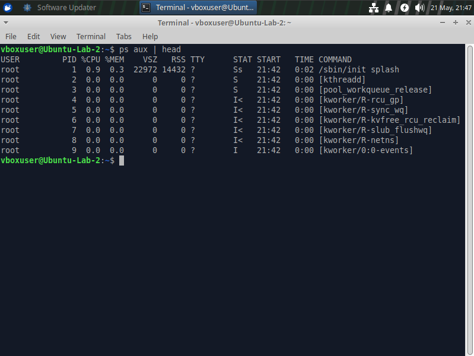
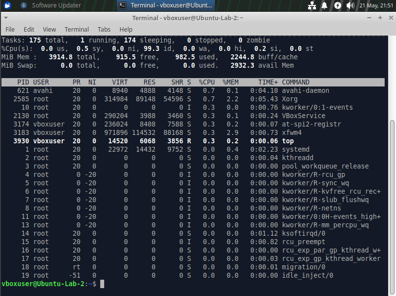
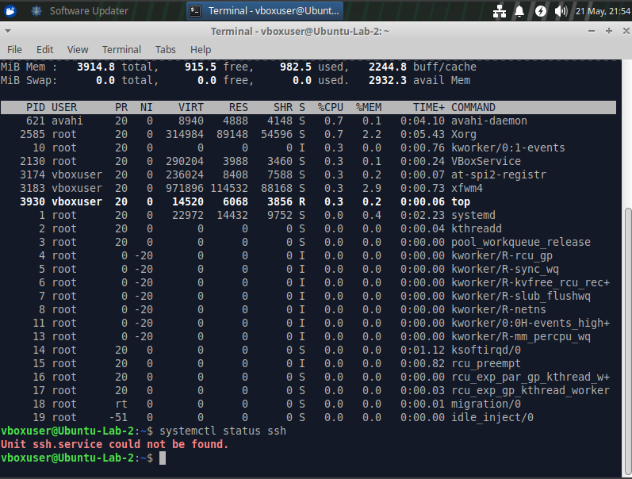
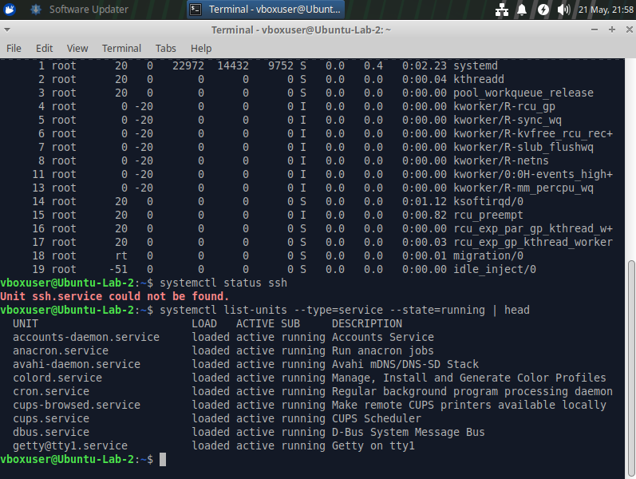

# Linux Process and Service Monitoring Lab

## Objective
Monitor running Linux processes and active system services to better understand operational visibility, resource usage, and service management concepts commonly used in cybersecurity and system administration.

---

## Lab Overview
In this lab, I explored how Linux systems manage running processes and services. I used monitoring and service management commands to inspect active processes, observe real-time system activity, analyze resource consumption, and review running services.

---

## Tools Used
- Ubuntu Virtual Machine
- Linux Terminal
- ps
- top
- systemctl

---

## Steps Performed

### 1. Viewed Running Processes

    ps aux | head

---

### 2. Monitored Processes in Real Time

    top

---

### 3. Checked Service Status

    systemctl status ssh

---

### 4. Listed Active Running Services

    systemctl list-units --type=service --state=running | head

---

## Key Findings

- Identified active Linux processes and associated resource usage
- Observed CPU and memory utilization in real time
- Reviewed active services currently running on the operating system
- Inspected service status using systemctl
- Confirmed that the SSH service was not installed on the system
- Improved visibility into Linux operational monitoring and process management

---

## What I Learned

This lab helped me better understand:

- Linux process monitoring
- Service management concepts
- Real-time resource monitoring
- Operational visibility techniques
- Process and service auditing
- The importance of monitoring active system activity

---

## Role Connection

This lab directly relates to cybersecurity operations, system administration, and security monitoring by demonstrating how Linux systems manage running processes and services. These concepts are important for endpoint visibility, threat hunting, operational monitoring, and identifying suspicious system activity.
